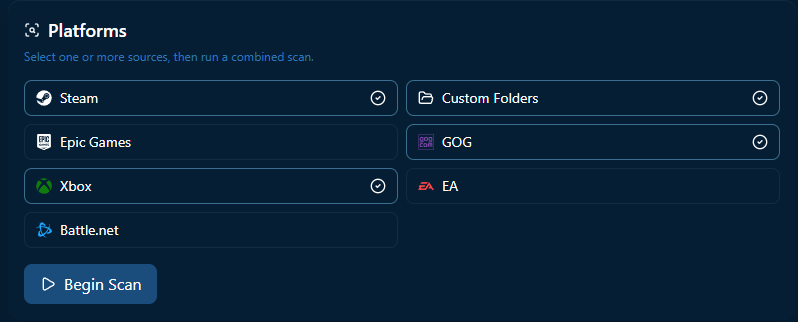
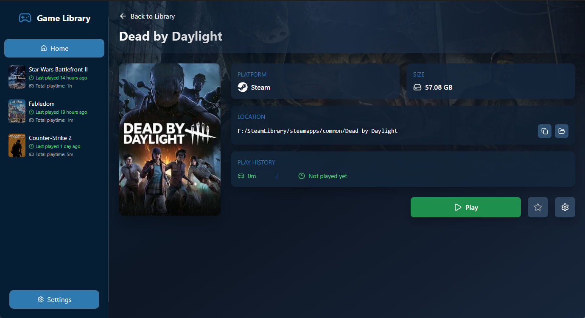
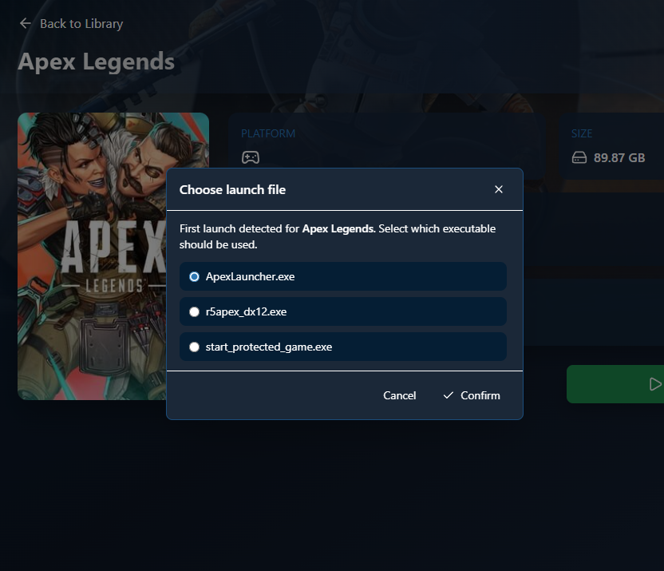
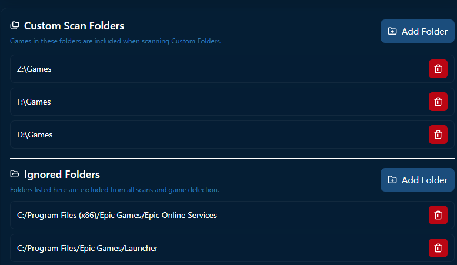

#  GameLibrary


GameLibrary is a desktop app to regroup all of your installed games from all launchers, as well as configurable custom folders or games.
It has an integrated game launcher and playtime tracker to centralize every playtime from all games

-----
## Features

- Game Scanner: Choose what platform you want to scan your installed games, and it will work by itself and scan for new games every time you launch or refresh the library


<br>
- Game Tracker: Track your playtime and your latest time played


<br>
- Custom Game Launcher: Specify launch arguments, choose your default launch file


<br>
- Custom Folders: Add custom folders where the app will try to find games on


<br>
- Special tags: Add special tags for modified games/fixed games
- IGDB API: Fetch all your games cover and artwork
- Favorites: Add your games to favorites to see them on top of your library
- Fully Client-side: The app only use IGDB for getting game covers, full name or thumbnail, which is not mandatory. The app can also make requests to Github for version checking, which is not mandatory too

-----

## How to install

- Go to the [RELEASES](https://github.com/Ezzud/gamelibrary/releases)
- Download **gamelibrary_x64-setup.exe**
- Launch the file and proceed to the installation

-----

## Stack

- Tauri v2
- React 19
- Vite
- TailwindCSS
- Lucide Icons
- NodeJS v20 + Typescript


-----

## How to compile yourself
Requirement: Rustc, NodeJS v20

- Clone the repo
- Execute command
```
pnpm run tauri build
```
- You will have the setup file + the .exe to directly launch the app in `src-tauri\target\release\bundle\nsis\`